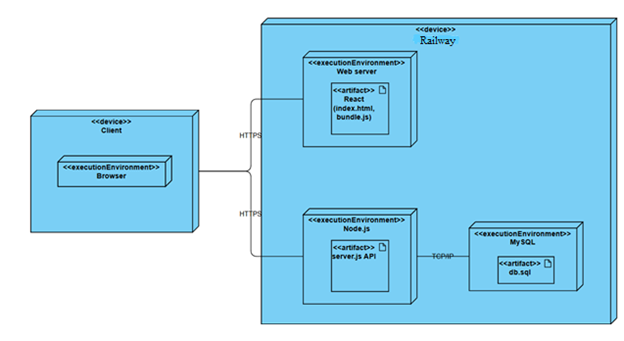

# El.-Parduotuve
T120B165 Saityno taikomųjų programų projektavimas - Projektas - Elektroninė parduotuvė

## Table of Contents
1. [Sprendžiamo uždavinio aprašymas](#sprendžiamo-uždavinio-aprašymas)
   - [Sistemos paskirtis](#sistemos-paskirtis)
   - [Funkciniai reikalavimai](#funkciniai-reikalavimai)
2. [Pasirinktų technologijų aprašymas](#pasirinktų-technologijų-aprašymas)

---

## Sprendžiamo uždavinio aprašymas

### Sistemos paskirtis
Projekto tikslas – patogi naudojimui ir valdymui elektroninės parduotuvės dalis, kurioje būtų prekių rūšys, jos visos turėtų atitinkamas prekes, o pačios prekės turėtų atsiliepimus.

Veikimo principas – internetinis puslapis, kuriame rodomos prekių rūšys, pasirinkus vieną iš rūšių, rodomos tos rūšies prekės, paspaudus ant prekės matyti atsiliepimai apie ją.  
Lankytojai galės tik peržiūrėti prekes ir atsiliepimus. Užsiregistravę lankytojai galės prisijungti prie savo paskyrų ir rašyti atsiliepimus apie prekes. Administratoriai galės ištrinti kenksmingus atsiliepimus, redaguoti prekes.

### Funkciniai reikalavimai
Sistema privalo turėti grafinę naudotojo sąsają, kuri leistų užsiregistruoti ar prisijungti prie savo paskyros, peržiūrėti prekes ir palikti atsiliepimus.  
Sistema turi būti pasiekiama saityne, taip pat palaikyti tris roles – administratorių, neregistruotą lankytoją ir prisijungusį lankytoją, kiekvienam iš jų suteikiant skirtingas prieigas.

#### Administratoriai gali:
- Sukurti naują prekių rūšį.
- Pašalinti egzistuojančią prekių rūšį.
- Redaguoti egzistuojančią prekių rūšį.
- Pridėti naujų prekių.
- Pašalinti esamas prekes.
- Redaguoti esamas prekes.
- Ištrinti nekorektiškus atsiliepimus.

#### Registruoti lankytojai gali:
- Peržiūrėti prekių rūšis ir jose esančias prekes.
- Peržiūrėti prekių atsiliepimus.
- Rašyti/ištrinti/redaguoti savo atsiliepimą.
- Įvertinti kitų atsiliepimus patinka/nepatinka mygtukais.

#### Neregistruoti lankytojai gali:
- Peržiūrėti prekių rūšis ir jose esančias prekes.
- Peržiūrėti prekių atsiliepimus.

---

## Pasirinktų technologijų aprašymas

Sistemos sudedamosios dalys:
- **Front-end:** React.js  
- **Back-end:** Node.js  
- **Duomenų bazė:** MySQL

