# El.-Parduotuve
T120B165 Saityno taikomųjų programų projektavimas - Projektas - Elektroninė parduotuvė

## Table of Contents
1. [Sprendžiamo uždavinio aprašymas](#sprendžiamo-uždavinio-aprašymas)
   - [Sistemos paskirtis](#sistemos-paskirtis)
   - [Funkciniai reikalavimai](#funkciniai-reikalavimai)
2. [Pasirinktų technologijų aprašymas](#pasirinktų-technologijų-aprašymas)
3. [Naudotojo sąsajos projektas](#naudotojo-sąsajos-projektas)
4. [API specifikacija](#api-specifikacija)

---

## Sprendžiamo uždavinio aprašymas

### Sistemos paskirtis
Projekto tikslas – patogi naudojimui ir valdymui elektroninės parduotuvės dalis, kurioje būtų prekių rūšys, jos visos turėtų atitinkamas prekes, o pačios prekės turėtų atsiliepimus.

Veikimo principas – internetinis puslapis, kuriame rodomos prekių rūšys, pasirinkus vieną iš rūšių, rodomos tos rūšies prekės, paspaudus ant prekės matyti atsiliepimai apie ją.  
Lankytojai galės tik peržiūrėti prekes ir atsiliepimus. Užsiregistravę lankytojai galės prisijungti prie savo paskyrų ir rašyti atsiliepimus apie prekes. Administratoriai galės ištrinti kenksmingus atsiliepimus, redaguoti prekes.

### Funkciniai reikalavimai
Sistema privalo turėti grafinę naudotojo sąsają, kuri leistų užsiregistruoti ar prisijungti prie savo paskyros, peržiūrėti prekes ir palikti atsiliepimus.  
Sistema turi būti pasiekiama saityne, taip pat palaikyti tris roles – administratorių, neregistruotą lankytoją ir prisijungusį lankytoją, kiekvienam iš jų suteikiant skirtingas prieigas.

#### Administratoriai gali:
- Sukurti naują prekių rūšį.
- Pašalinti egzistuojančią prekių rūšį.
- Redaguoti egzistuojančią prekių rūšį.
- Pridėti naujų prekių.
- Pašalinti esamas prekes.
- Redaguoti esamas prekes.
- Ištrinti nekorektiškus atsiliepimus.

#### Registruoti lankytojai gali:
- Peržiūrėti prekių rūšis ir jose esančias prekes.
- Peržiūrėti prekių atsiliepimus.
- Rašyti/ištrinti/redaguoti savo atsiliepimą.
- Įvertinti kitų atsiliepimus patinka/nepatinka mygtukais.

#### Neregistruoti lankytojai gali:
- Peržiūrėti prekių rūšis ir jose esančias prekes.
- Peržiūrėti prekių atsiliepimus.

---

## Pasirinktų technologijų aprašymas

Sistemos sudedamosios dalys:
- **Front-end:** React.js  
- **Back-end:** Node.js  
- **Duomenų bazė:** MySQL

  
  
Paveikslėlis 1: Sistemos diegimo diagrama

 
Iš diegimo diagramos matyti, jog sistema yra talpinama Railway serveryje, klientas bendrauja su sistema per HTTPS protokolą.

---

## Naudotojo sąsajos projektas

  
  
Paveikslėlis 2: Pagrindinis puslapis wireframe

 

  
  
Paveikslėlis 3: Pagrindinis puslapis

 

  
  
Paveikslėlis 4: Informacijos puslapis „About us“ wireframe

 

  
  
Paveikslėlis 5: Informacijos puslapis „About us“

 

  
  
Paveikslėlis 6: Pagalbos puslapis „Help“ wireframe

 

  
  
Paveikslėlis 7: Pagalbos puslapis „Help“

 

  
  
Paveikslėlis 8: Tam tikro tipo produktų puslapis wireframe

 

  
  
Paveikslėlis 9: Tam tikro tipo produktų puslapis

 

  
  
Paveikslėlis 10: Tam tikro produkto puslapis wireframe

 

  
  
Paveikslėlis 11: Tam tikro produkto puslapis

 

  
  
Paveikslėlis 12: Prisijungimo modalinis langas wireframe

 

  
  
Paveikslėlis 13: Prisijungimo modalinis langas

 

  
  
Paveikslėlis 14: Registracijos modalinis langas wireframe

 

  
  
Paveikslėlis 15: Registracijos modalinis langas

 

  
  
Paveikslėlis 16: Produkto administratoriaus puslapis wireframe

 

  
  
Paveikslėlis 17: Produkto administratoriaus puslapis

 

  
  
Paveikslėlis 18: Pagrindinis administratoriaus puslapis wireframe

 

  
  
Paveikslėlis 19: Pagrindinis administratoriaus puslapis

 

  
  
Paveikslėlis 20: Produktų tipo administratoriaus puslapis wireframe

 

  
  
Paveikslėlis 21: Produktų tipo administratoriaus puslapis

 

---

## API specifikacija

### Tipai
**Get all**

**Atsako kodai**:

200	
List of types

500	
Internal server error

**Panaudojimo pavyzdžiai**:

  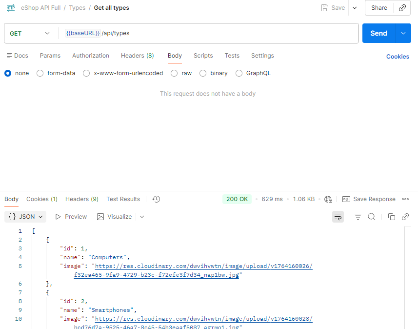
  
Paveikslėlis 22: Get all tipo užklausa/atsakymas

**Get by id**

**Atsako kodai**:

200	
Type object

404	
Type not found

500	
Internal server error

**Panaudojimo pavyzdžiai**:

  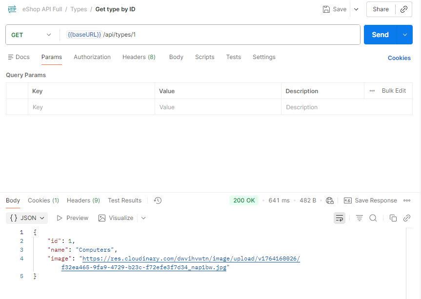
  
Paveikslėlis 22: Get by id tipo užklausa/atsakymas

**Create**

**Atsako kodai**:

201	
Type created

400	
Name required

403	
Forbidden (requires admin)

409	
Duplicate type name

500	
Internal server error

**Panaudojimo pavyzdžiai**:

  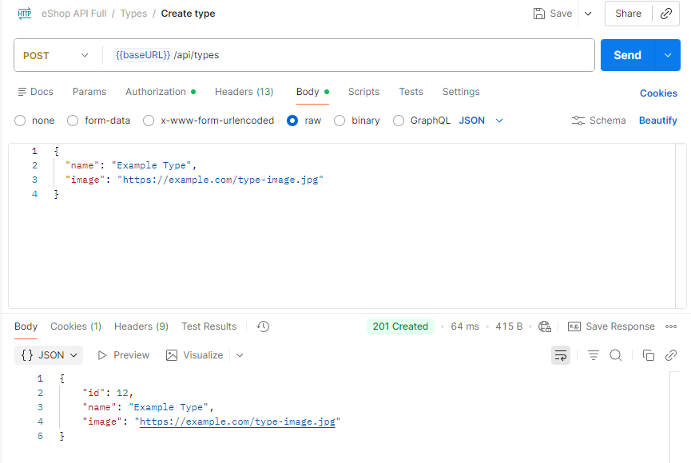
  
Paveikslėlis 23: Create tipo užklausa/atsakymas

**Update**

**Atsako kodai**:

200	
Type updated

400	
Name required

403	
Forbidden (requires admin)

404	
Type not found

500	
Internal server error

**Panaudojimo pavyzdžiai**:

  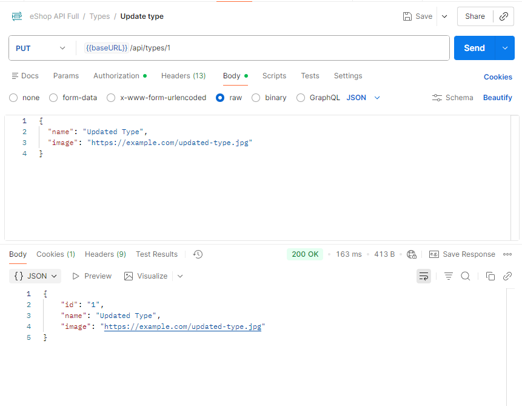
  
Paveikslėlis 24: Update tipo užklausa/atsakymas

**Delete**

**Atsako kodai**:

204	
Type deleted

403	
Forbidden (requires admin)

404	
Type not found

500	
Internal server error

**Panaudojimo pavyzdžiai**:

  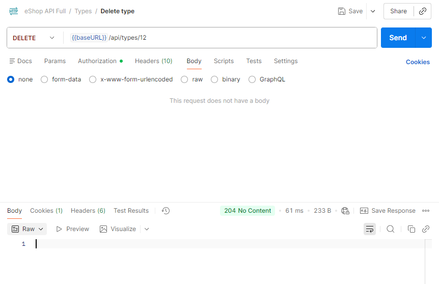
  
Paveikslėlis 25: Delete tipo užklausa/atsakymas

**Get products by type**

**Atsako kodai**:

200	
Products for the type

404	
Type not found

500	
Internal server error

**Panaudojimo pavyzdžiai**:

  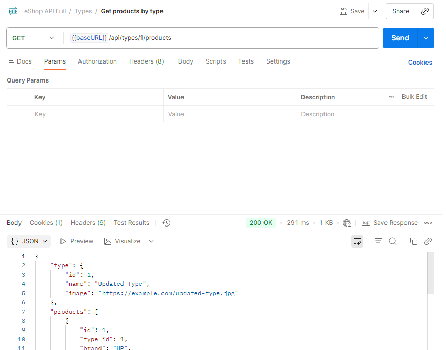
  
Paveikslėlis 26: Get products by type užklausa/atsakymas

**Get reviews by product/type**

**Atsako kodai**:

200	
List of reviews

404	
Type or product not found

500	
Internal server error

**Panaudojimo pavyzdžiai**:

  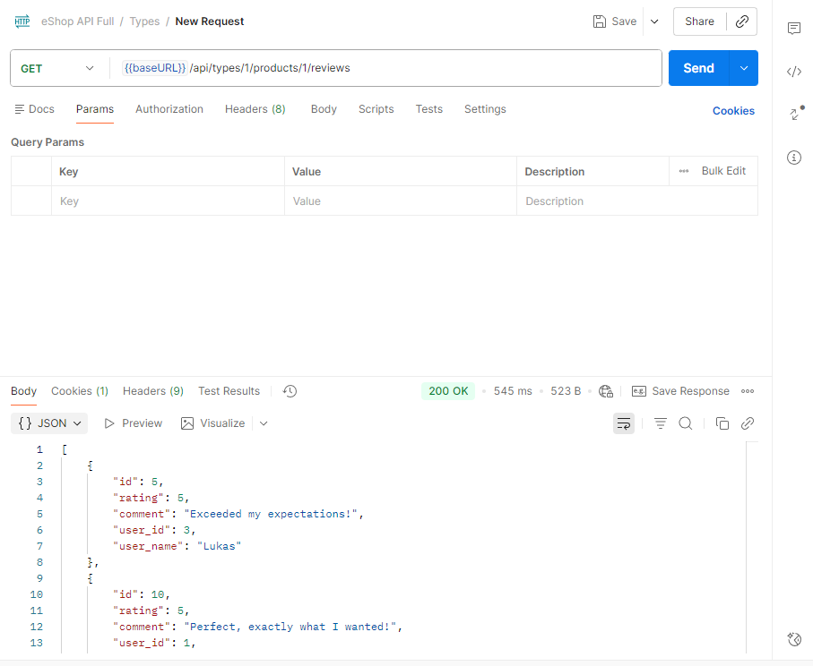
  
Paveikslėlis 27: Get reviews by product/type užklausa/atsakymas

### Produktai

**Get all**

**Atsako kodai**:

200	
List of products

500	
Internal server error

**Panaudojimo pavyzdžiai**:

  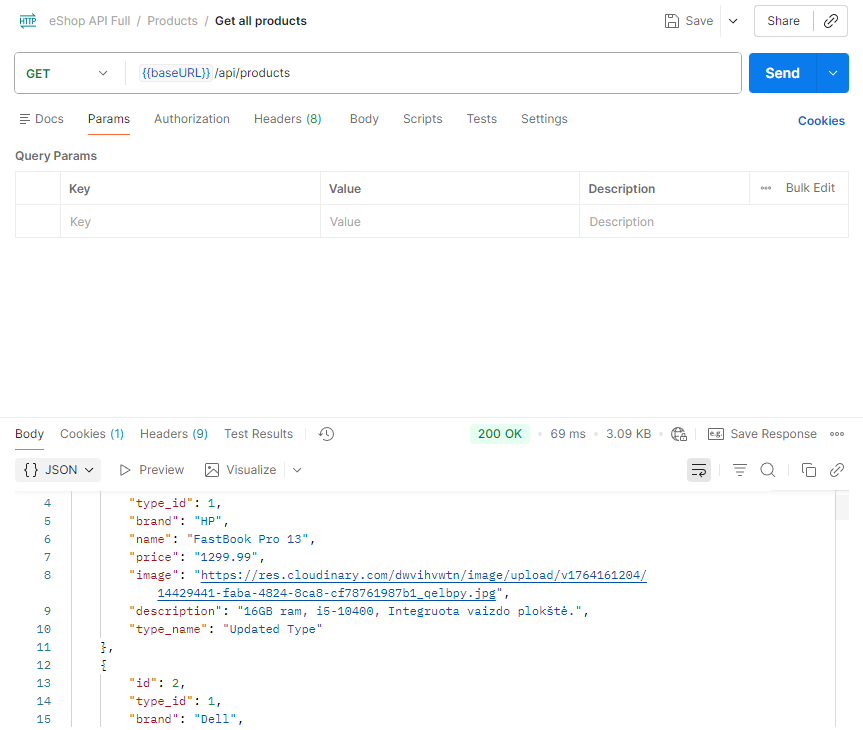
  
Paveikslėlis 28: Get all tipo užklausa/atsakymas

**Get by id**

**Atsako kodai**:

200	
Product object

404	
Product not found

500	
Internal server error

**Panaudojimo pavyzdžiai**:

  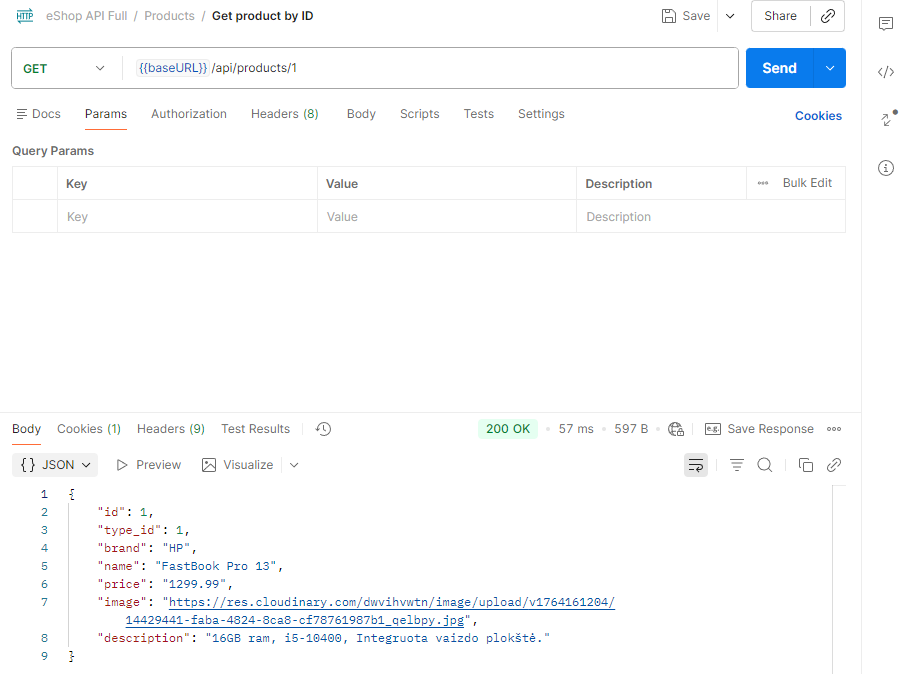
  
Paveikslėlis 29: Get by id tipo užklausa/atsakymas

**Create**

**Atsako kodai**:

201	
Product created

400	
Invalid payload

403	
Forbidden (requires admin)

409	
Product already exists

500	
Internal server error

**Panaudojimo pavyzdžiai**:

  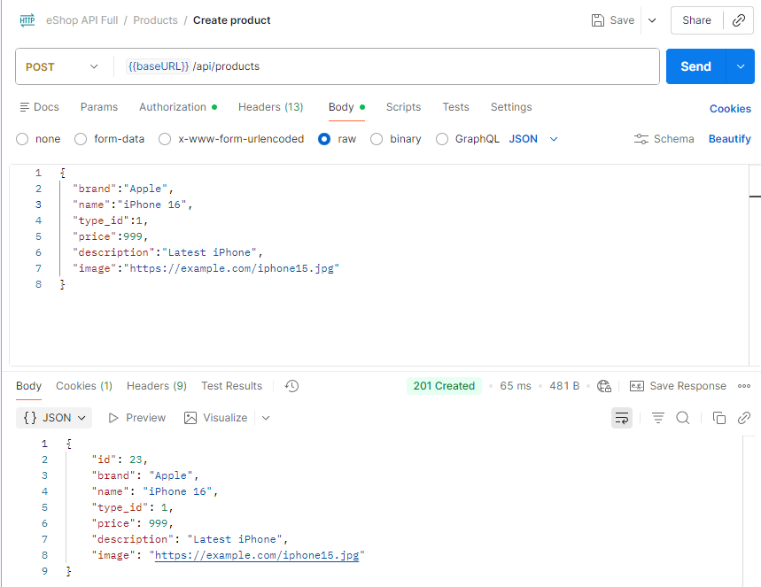
  
Paveikslėlis 30: Create tipo užklausa/atsakymas

**Update**

**Atsako kodai**:

200	
Product updated

400	
Invalid input data

403	
Forbidden (requires admin)

404	
Product not found

500	
Internal server error

**Panaudojimo pavyzdžiai**:

  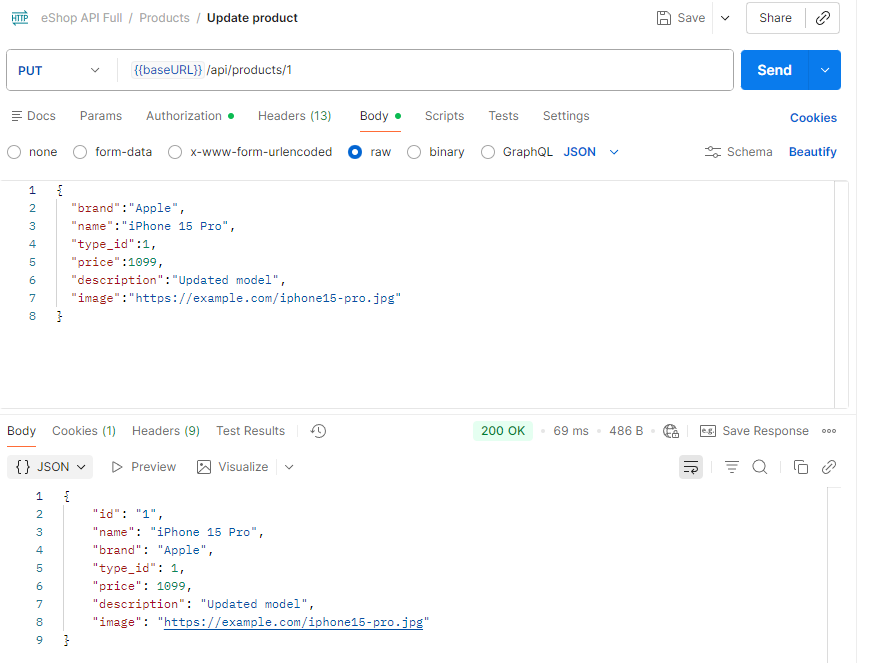
  
Paveikslėlis 31: Update tipo užklausa/atsakymas

**Delete**

**Atsako kodai**:

204	
Product deleted

403	
Forbidden (requires admin)

404	
Product not found

500	
Internal server error

**Panaudojimo pavyzdžiai**:

  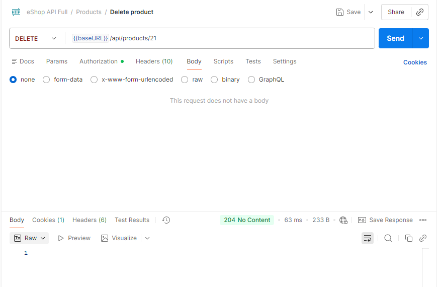
  
Paveikslėlis 32: Delete tipo užklausa/atsakymas

### Atsiliepimai

**Get all**

**Atsako kodai**:

200	
List of reviews

500	
Internal server error

**Panaudojimo pavyzdžiai**:

  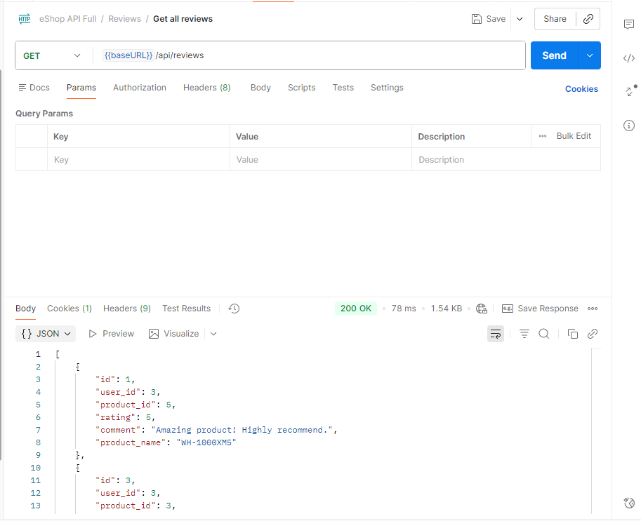
  
Paveikslėlis 33: Get all tipo užklausa/atsakymas

**Get by id**

**Atsako kodai**:

200	
Review object

404	
Review not found

500	
Internal server error

**Panaudojimo pavyzdžiai**:

  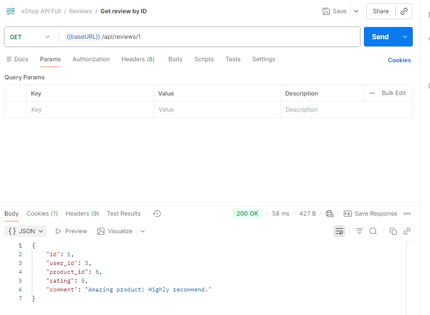
  
Paveikslėlis 34: Get by id tipo užklausa/atsakymas

**Create**

**Atsako kodai**:

201	
Review created

400	
Invalid payload

500	
Internal server error

**Panaudojimo pavyzdžiai**:

  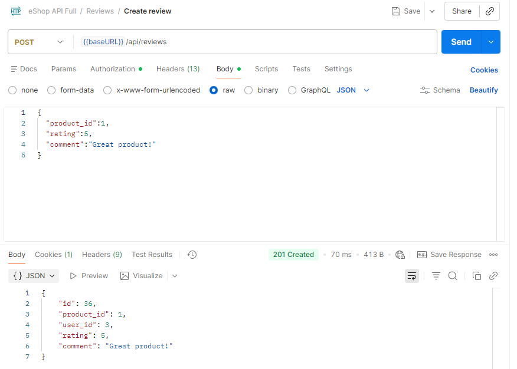
  
Paveikslėlis 35: Create tipo užklausa/atsakymas

**Update**

**Atsako kodai**:

200	
Review updated

400	
Invalid payload or user_id mismatch

403	
Forbidden (not owner/admin)

404	
Review not found

500	
Internal server error

**Panaudojimo pavyzdžiai**:

  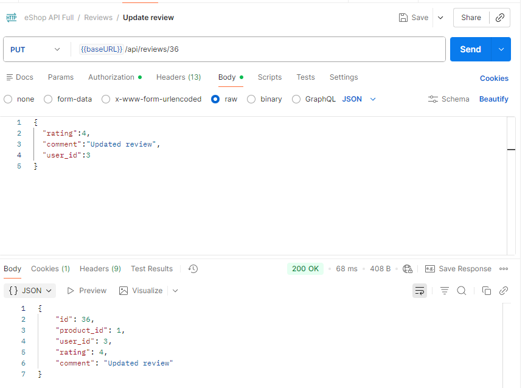
  
Paveikslėlis 36: Update tipo užklausa/atsakymas

**Delete**

**Atsako kodai**:

204	
Review deleted

403	
Forbidden (not owner/admin)

404	
Review not found

500	
Internal server error

**Panaudojimo pavyzdžiai**:

  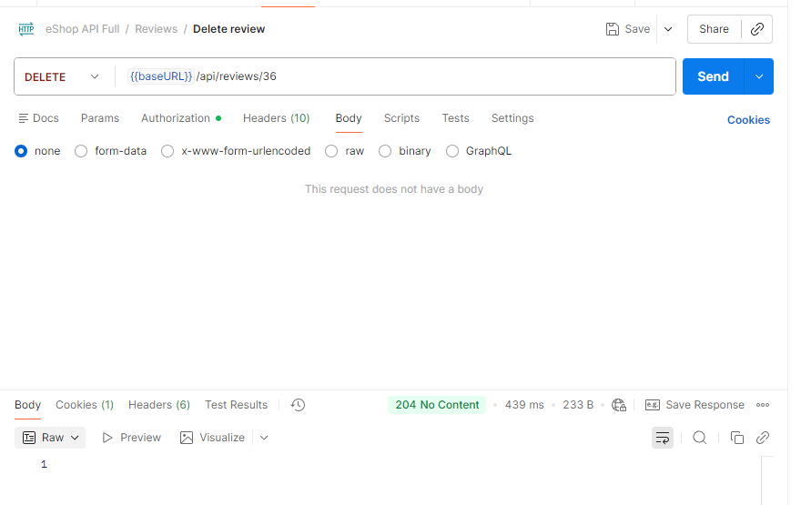
  
Paveikslėlis 37: Delete tipo užklausa/atsakymas

### Autentifikacija

**Register**

**Atsako kodai**:

201	
User registered

400	
Missing fields

409	
Email already exists

500	
Internal server error

**Panaudojimo pavyzdžiai**:

  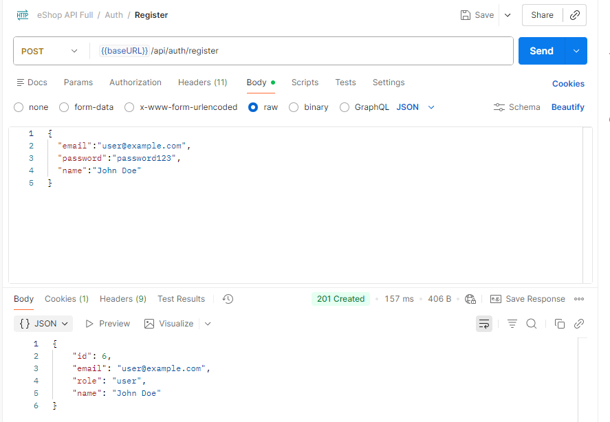
  
Paveikslėlis 38: Register tipo užklausa/atsakymas

**Login**

**Atsako kodai**:

200	
Returns access token

401	
Invalid credentials

500	
Internal server error

**Panaudojimo pavyzdžiai**:

  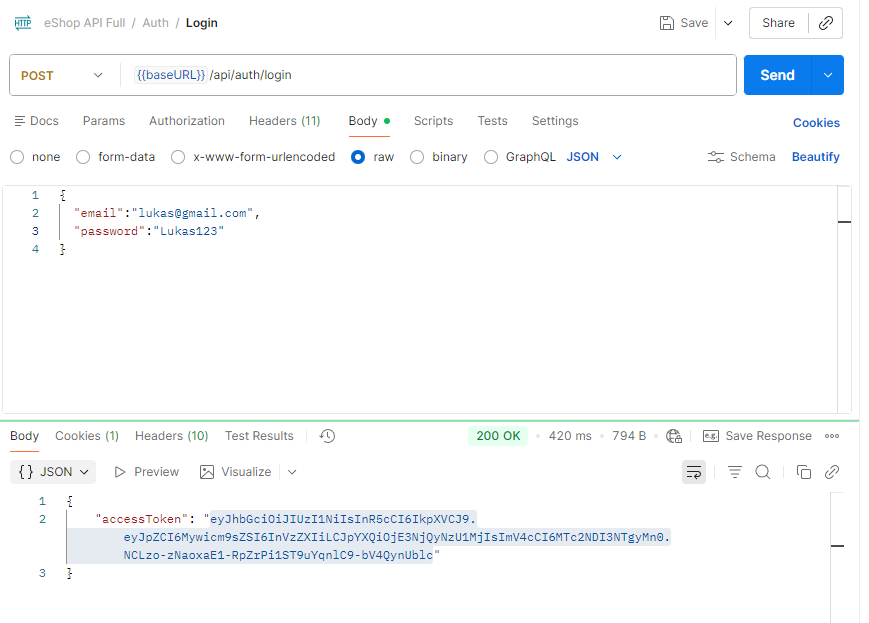
  
Paveikslėlis 39: Login tipo užklausa/atsakymas

**Refresh**

**Atsako kodai**:

200	
New access token

401	
Invalid or missing refresh token

403	
Session expired or invalid

500	
Internal server error

**Panaudojimo pavyzdžiai**:

  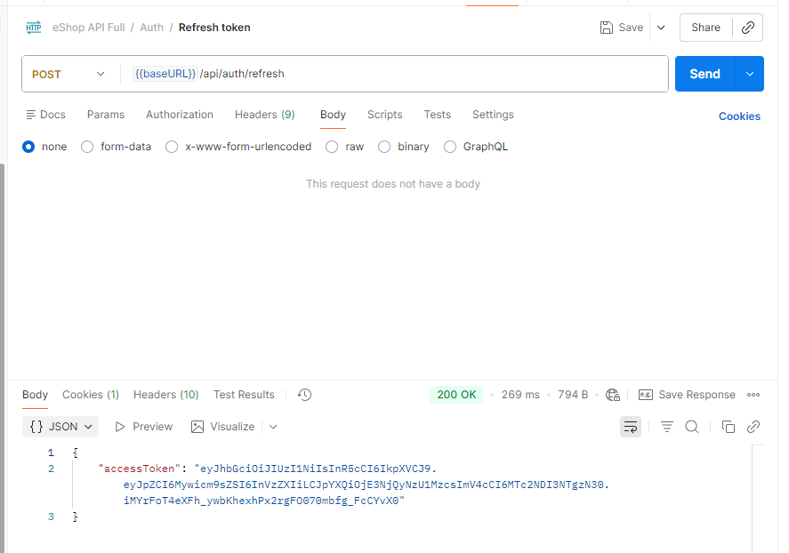
  
Paveikslėlis 40: Refresh tipo užklausa/atsakymas

**Logout**

**Atsako kodai**:

200	
Logged out

500	
Internal server error

**Panaudojimo pavyzdžiai**:

  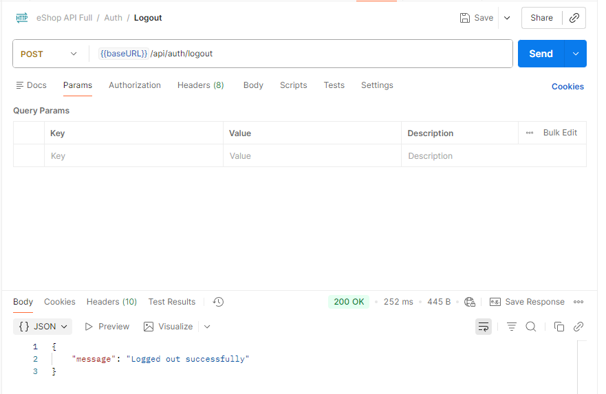
  
Paveikslėlis 41: Logout tipo užklausa/atsakymas

**Me**

**Atsako kodai**:

200	
Current user info

404	
User not found

500	
Internal server error

**Panaudojimo pavyzdžiai**:

  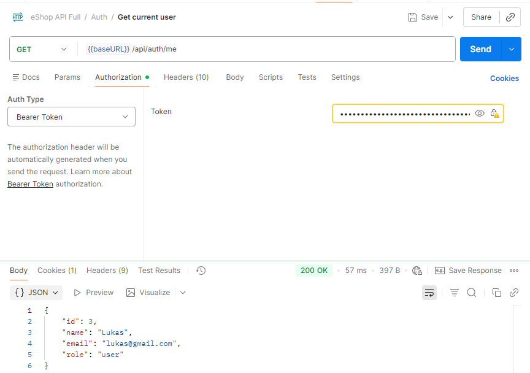
  
Paveikslėlis 42: Me tipo užklausa/atsakymas

